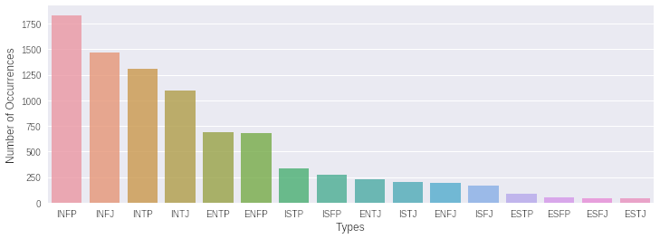
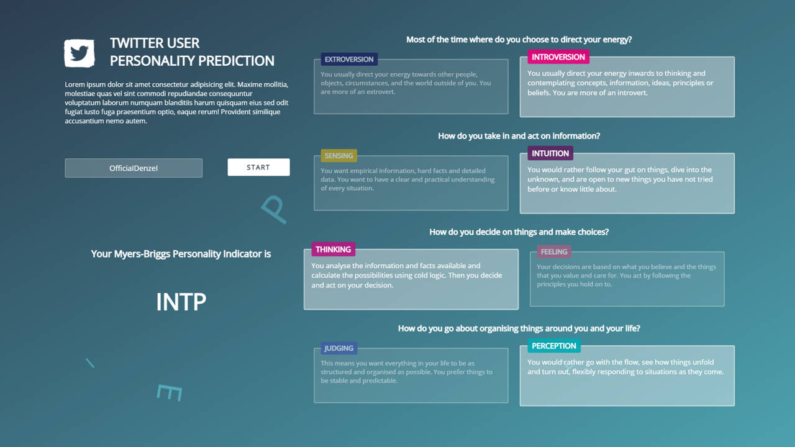

# Personality Types Predictor
Questo progetto è stato realizzato come replica ed estensione di un progetto già esistente, discusso nel report disponibile nell’archivio di ***web.stanford.edu[1]***. Intendiamo utilizzare l'apprendimento automatico per costruire un classificatore che accetterà dei post ricavati da un profilo Twitter come input e produrrà come output una previsione del tipo di personalità MBTI dell'autore di detto testo.
Il progetto va ad utilizzare il machine learning per ricreare il classificatore discusso nel report, che grazie all'aggiunta di un interfaccia grafica e dell'integrazione con l'API di Twitter per acquisire il feed di un account, andrà a  classificare il profilo in tempo reale in un ***Myers-Briggs Type Indicator (MBTI) [2]***, una metrica che utilizza un risultato di 4 lettere (eg. INFJ o ENFP) per riassumere le diverse caratteristiche della personalità in termini di come gli individui percepiscono il mondo e prendono decisioni.

Per avere un confronto con quanto prodotto e per verificare quanto affermato nel report, è stato prodotto anche un classificatore Naive Bayes che verrà discusso in seguito.

Normalmente questo risultato deriva dall’utilizzo di questionari e test psicometrici somministrati a ciascuna persona, ma qui otterremo automaticamente un risultato attraverso una semplice interfaccia grafica web, alla quale basta fornire soltanto l’handle del proprio account Twitter.

Il progetto è realizzato principalmente in Python, ad eccezione dell’interfaccia web che viene comunque gestita da Python tramite l’utilizzo di Flask. 
  

# Introduzione - MBTI
L'obiettivo dell'MBTI è quello di consentire agli intervistati di esplorare e comprendere la propria personalità, compresi i propri gusti, antipatie, punti di forza, punti deboli, possibili preferenze di carriera e compatibilità con altre persone. Nessun tipo di personalità è migliore o peggiore dell’altra. Il questionario stesso è centrato sull’analisi di quattro dicotomie:

***Estroversione (E) – Introversione (I)***

La dicotomia estroversione-introversione si utilizza come un metodo per descrivere come le persone rispondono e interagiscono con il mondo che li circonda. Gli estroversi sono "volti verso l'esterno" e tendono ad essere orientati all'azione mentre gli introversi tendono ad essere orientati al pensiero.
_ _ _ 
***Sensibilità (S) – Intuizione (N)***

Questa implica l'osservazione di come le persone raccolgono informazioni dal mondo che 
le circonda. Le persone che preferiscono la sensibilità tendono a prestare molta attenzione alla realtà, in particolare a ciò che possono imparare dai propri sensi, mentre coloro che preferiscono l'intuizione prestano maggiore attenzione alle possibilità e alla pianificazione del proprio futuro.
_ _ _ 
***Pensare (V) – Sentire (F)***

Questa scala si concentra su come le persone prendono decisioni in base alle informazioni che hanno raccolto dalle loro funzioni di rilevamento o intuizione. Le persone che preferiscono pensare danno maggiore enfasi ai fatti e ai dati oggettivi.
Coloro che preferiscono i sentimenti sono più propensi a considerare le persone e le emozioni quando arrivano a una conclusione.
_ _ _ 
***Giudicare (J) – Percepire (P)***

L’ultima dicotomia riguarda il modo in cui le persone tendono a trattare con il mondo esterno. Coloro che tendono a giudicare preferiscono pensiero strutturato e le decisioni ferme. Le persone che propendono per la percezione sono più aperte, flessibili e adattabili
  

# Dataset
Il ***dataset[3]*** utilizzato è disponibile pubblicamente su Kaggle. Si tratta di un csv contenente oltre 8600 righe di dati, nel quale ognuna è composta da due colonne con i dati relativi ad una profilo: 
* Il tipo (codice/tipo MBTI di 4 lettere di questa persona)
* Una sezione di ciascuna degli ultime 50 post che hanno pubblicato ogni voce separata da 3 caratteri pipe  "|||" 

Questi dati sono stati raccolti tramite PersonalityCafe, un forum online in cui gli utenti registrati sono stati sottoposti al questionario per l’assegnazione del loro tipo MBTI, per essere poi liberi di chattare con altri utenti sul forum. Poiché ci sono cinquanta post inclusi per ogni utente, il numero di post è circa 430000. 
  

## Proporzionalità
Un problema evidente in questo dataset è la rappresentazione non uniforme dei tipi, che non rispettano le proporzioni del mondo reale. Questo, come discusso nel report, rende necessaria una modifica per riportare una proporzione uniforme nel test set. Pertanto, si è operata una selezione sul dataset selezionando il tipo di MBTI con il minor numero di post e seguendo il riferimento alle proporzioni trovate su ***myersbriggs.org [4]*** si è creato un test set che rispetta le proporzioni reali. 

In questo modo si cercano di prevenire gli errori nei risultati, dovuti alla rappresentazione distorta delle classi nel set di test che sono 
indicati nel grafico sottostante. 

 

  

## Stop words
Il dataset analizzato proviene da un forum online, diventa dunque necessario la rimozione di alcune parole che nell’analisi risulterebbero di poco valore. Ad esempio, nei post sono presenti le cosiddette stop words, link a siti esterni ed anche codici per rappresentare emoticons.  Infine sono stati rimossi anche i riferimenti espliciti ai tipi stessi (ad es. 'INTJ', 'INFP', ecc.), in modo da prevenire al modello imparando a riconoscere i tipi di MBTI per nome. La rimozione è stata effettuata tramite l’utilizzo di Natural Language Toolkit (NLTK), una libreria Python open source per l'elaborazione del linguaggio naturale e con l’utilizzo delle regex per identificare links e emoticons/emoji. 
  

## Lemmatizzazione 
Per la lemmatizzazione è stato utilizzato il WordNetLemmatizer sempre della libreria NLTK. 
Lemmatizzare il testo significa ridurre più forme differenti della stessa parola ad un’unica parola radice. 
Questo ci permette di ricondurre più forme della stessa parola ad un unico significato e semplifica 
notevolmente il lavoro del classificatore.
  

## Tokenizzazione
Utilizzando un tokenizzatore presente nella libreria Keras, abbiamo tokenizzato le 2500 parole più comuni del testo lemmatizzato.
In questo modo il testo viene trasformato una serie di elenchi di interi selezionati dal nostro vocabolario di 2500 parole, eliminando 
dal testo tutte le parole che non sono presenti nel dizionario. Così facendo si rimuovono le parole che non avrebbero avuto lo stesso 
impatto nel modello.
  

## Padding
Poiché i post tokenizzati sono di lunghezza molto variabile, procediamo rendendoli tutti della stessa lunghezza. 
Viene allora aggiunto del padding per ogni post tokenizzato in modo tale che abbia esattamente 40 interi.
Se sono presenti meno di 40 interi nel post tokenizzato, vengono aggiunti degli zero fino a quando 
non abbiamo raggiunto la dimensione e vengono rimossi se ce ne sono di più. 
  
# Modello
## Embedding Layer
Per l’embedding layer si usa una embedding matrix sotto forma di dizionario che mappa ogni parola lemmatizzata 
alla rappresentazione GloVe a 50 dimensioni di quella parola. GloVe (Global Vectors for Word Representation) è un algoritmo 
per ottenere rappresentazioni vettoriali per le parole. 
Il file che andremo ad utilizzare, a differenza del progetto originario, il vettore pre-addestrato su un enorme quantità di dati presi direttamente da Twitter, disponibile sul ***repository ufficiale[5]***.

* Twitter (2B tweets, 27B tokens, 1.2M vocab, 200d vectors, 1.42 GB)
  

## Recurrent Neural Network
Per ricreare il modello presentato nel report si utilizza una rete neurale ricorrente (RNN), e tra i vari tipi di RNN si sceglie di utilizzare l'opzione LSTM che offre i migliori risultati. 
Per questo come per gli altri layer utilizzati ci serviamo della libreria Keras.
  

## Dense Layer e Ottimizzazione
Infine, utilizziamo uno dense layer con la sigmoide come funzione di attivazione per produrre un valore compreso tra 0 e 1, che rappresenta la probabilità di classe prevista, poiché ci sono solo due classi.
Inoltre, seguendo il report, viene utilizzata binary crossentropy per la loss function (poiché ci sono solo due classi) e un ottimizzatore Adam dalla libreria degli optimizers per karas di tensorflow.
  

# Esperimento
Una volta osservata la natura dell'indicatore Myers-Briggs ed anche la sproporzionalità delle classi nel test set, si sceglie di suddividere la classificazione delle 16 classi in quattro attività di classificazione, facendo riferimento alle quattro dicotomie dell’indicatore. Questo perché un tipo MBTI è composto da quattro classi binarie, dove ogni 
classe binaria rappresenta una dimensione della personalità come teorizzato dagli inventori del modello. 

Pertanto si andranno ad addestrare quattro diversi classificatori binari, in modo tale che ciascuno sia specializzato in una delle dimensioni della personalità. La somma dei risultati andrà a rappresentare il tipo di indicatore.

Per confrontare i risultati con il report è stata svolta la classificazione dei post sul test set pre-elaborato e previsto la classe per ogni singolo post. 
Sono stati prodotti dunque l’accuracy e una matrice di confusione per ogni dimensione MBTI.

Allo stesso modo sono stati addestrati quattro classificatori Naive Bayes per le quattro dimensioni della personalità. Questo confronto con un classificatore Bayesiano servirà a
determinare se l'utilizzo della RNN riesca a produrre risultati superiori come afferma il report. Si utilizza un MultinomialNB come classificatore per il confronto dalla libreria sklearn.

>Due to the fact that our data set is composed of sequential text data, we decided to use a recurrent neural network in order to capture some of the information in the text data that would otherwise be ignored (e.g. as with a naive Bayes classifier).

 

# Risultati
Per la classificazione dei post sul test set precedentemente elaborato, abbiamo una previsione della classe per ogni singolo post. Ad entrambi è stata applicata la k-fold cross validation (CV) che consiste nella suddivisione dell'insieme di dati totale in k=5 parti di uguale numerosità e, a ogni passo, la kª parte dell'insieme di dati viene utilizzata come test set, mentre la restante parte costituisce il train set. 

Qui seguono Il punteggio di accuratezza e una matrice di confusione per ogni dimensione MBTI per il classificatore RNN.

Sebbene ciò sembri indicare una debole capacità complessiva del nostro modello di classificare correttamente tutte e quattro le dimensioni MBTI, va notato che, in effetti, altri modelli che si concentrano sulla classificazione multiclasse di MBTI possono ottenere una maggiore precisione della classificazione perfetta, ma lo fanno rischiando di sbagliare completamente la loro previsione. 
Il modello rappresenta un compromesso di questi due aspetti: otteniamo tassi inferiori di classificazione perfetta in cambio di tassi più elevati di classificazione approssimativamente corretta.

Rimane confermata l'affermazione fatta sui classificatori Bayesiani che hanno prodotto
* I/E Accuracy: 50.4 %
* N/S Accuracy: 51.8 %
* F/T Accuracy: 51.1 %
* P/J Accuracy: 49.2 %

  
# Twitter
Tramite l’utilizzo dell’API fornita da Twitter dopo la creazione di un account da sviluppatore, il sistema riesce a recuperare in forma 
testuale gli ultimi 100 post dal profilo della persona analizzata. A questi viene eseguito lo stesso lavoro di rimozione, lemmatizzazione
e tokenizzazione che è stato descritto in precedenza per il dataset. Su questi dati viene utilizzato il modello per determinare il tipo di MBTI. 
  

# Interfaccia
L’interfaccia è una pagina web che può essere aperta in locale attraverso l’esecuzione di main.py. Qui attraverso l’utilizzo di Flask avviene la comunicazione tra la pagina web e il sistema, che una volta ricevuto l’handle recupera i post e avvia la procedura.

Segue uno screen dell’interfaccia grafica a termine dell’esecuzione del processo.

  

# Rifetimenti
* [1] Report web.stanford.edu - https://web.stanford.edu/class/archive/cs/cs224n/cs224n.1184/reports/6839354.pdf
* [2] Myers-Briggs Type Indicator (MBTI) - https://it.wikipedia.org/wiki/Indicatore_Myers-Briggs
* [3] MBTI Dataset Kaggle - https://www.kaggle.com/datasnaek/mbti-type
* [4] Proporzioni MBTI - https://www.myersbriggs.org/my-mbti-personality-type/my-mbti-results/how-frequent-is-my-type.htm
* [5] GloVe - https://github.com/stanfordnlp/GloVe
